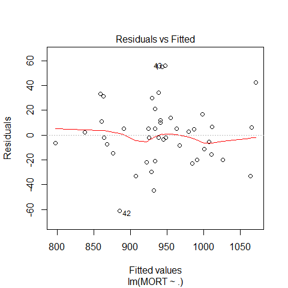
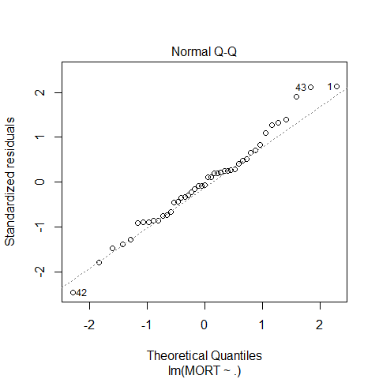
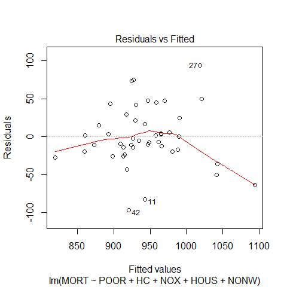
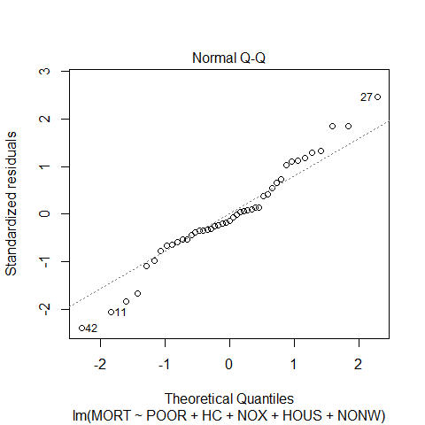

STAT406 - Lecture 1 notes
================
Matias Salibian-Barrera
2017-08-22

Lecture slides
--------------

The lecture slides are [here](STAT406-17-lecture-1.pdf).

Predictions using a linear model
--------------------------------

In this document we will explore (rather superficially) the difficulty in estimating the forecasting properties of a (linear) predictor. We will use the air-pollution data sets--a training set and a test set.

If you are interested, this is how these sets were constructed:

``` r
x <- read.csv('rutgers-lib-30861_CSV-1.csv')
set.seed(123)
ii <- sample(rep(1:4, each=15))
# training set `pollution-train.dat`
x.tr <- x[ii != 2, ]
# test set `pollution-test.dat`
x.te <- x[ii == 2, ]
# write.csv(x.tr, file='pollution-train.dat', row.names=FALSE, quote=FALSE)
# write.csv(x.te, file='pollution-test.dat', row.names=FALSE, quote=FALSE)
```

We will read the data from the file `pollution-train.dat` available [here](pollution-train.dat), and check that it was read properly:

``` r
x.tr <- read.table('pollution-train.dat', header=TRUE, sep=',')
# sanity check
head(x.tr)
```

    ##   PREC JANT JULT OVR65 POPN EDUC HOUS DENS NONW WWDRK POOR HC NOX SO.
    ## 1   35   23   72  11.1 3.14 11.0 78.8 4281  3.5  50.7 14.4  8  10  39
    ## 2   47   45   79   6.5 3.41 11.1 77.5 3125 27.1  50.2 20.6 18   8  24
    ## 3   43   35   77   7.6 3.44  9.6 84.6 6441 24.4  43.7 14.3 43  38 206
    ## 4   53   45   80   7.7 3.45 10.2 66.8 3325 38.5  43.1 25.5 30  32  72
    ## 5   45   30   73   9.3 3.29 10.6 86.0 2140  5.3  40.4 10.5  6   4   4
    ## 6   36   24   70   9.0 3.31 10.5 83.2 6582  8.1  42.5 12.6 18  12  37
    ##   HUMID     MORT
    ## 1    57  997.875
    ## 2    56  982.291
    ## 3    55 1071.289
    ## 4    54 1030.380
    ## 5    56  899.529
    ## 6    61 1001.902

We now fit a a linear regression model with all available predictors and look at the estimated parameters:

``` r
full <- lm(MORT ~ . , data=x.tr)
# look at the estimated coefficients
summary(full)
```

    ## 
    ## Call:
    ## lm(formula = MORT ~ ., data = x.tr)
    ## 
    ## Residuals:
    ##     Min      1Q  Median      3Q     Max 
    ## -61.147 -15.644  -2.018  11.162  56.094 
    ## 
    ## Coefficients:
    ##               Estimate Std. Error t value Pr(>|t|)    
    ## (Intercept)  2.243e+03  4.665e+02   4.809 4.31e-05 ***
    ## PREC         1.952e+00  9.417e-01   2.073 0.047168 *  
    ## JANT        -1.366e+00  1.171e+00  -1.166 0.253036    
    ## JULT        -3.696e+00  2.014e+00  -1.835 0.076856 .  
    ## OVR65       -2.054e+01  9.144e+00  -2.247 0.032451 *  
    ## POPN        -1.030e+02  7.315e+01  -1.409 0.169574    
    ## EDUC        -5.627e+01  1.402e+01  -4.014 0.000386 ***
    ## HOUS        -2.086e+00  1.830e+00  -1.140 0.263643    
    ## DENS         1.297e-02  4.931e-03   2.630 0.013537 *  
    ## NONW         2.212e+00  1.570e+00   1.409 0.169494    
    ## WWDRK        3.473e+00  1.752e+00   1.982 0.056983 .  
    ## POOR        -2.248e+00  3.288e+00  -0.684 0.499547    
    ## HC          -1.379e+00  6.268e-01  -2.200 0.035949 *  
    ## NOX          3.014e+00  1.321e+00   2.281 0.030064 *  
    ## SO.         -3.021e-01  1.879e-01  -1.608 0.118673    
    ## HUMID        8.630e-01  1.203e+00   0.717 0.478859    
    ## ---
    ## Signif. codes:  0 '***' 0.001 '**' 0.01 '*' 0.05 '.' 0.1 ' ' 1
    ## 
    ## Residual standard error: 29.88 on 29 degrees of freedom
    ## Multiple R-squared:  0.8603, Adjusted R-squared:  0.788 
    ## F-statistic:  11.9 on 15 and 29 DF,  p-value: 1.328e-08

In addition, display a few diagnostic plots where everything looks fine

``` r
plot(full, which=1)
```



``` r
plot(full, which=2)
```



The objective is to compare the quality of this model's predictions with those of a simpler (smaller) linear model, one using only 5 predictors (how these were selected is not important for this illustrative example, but will be *critical* later in the course). We now fit this reduced model and look at the estimated parameters and diagnostic plots

``` r
reduced <- lm(MORT ~ POOR + HC + NOX + HOUS + NONW, data=x.tr)
summary(reduced)
```

    ## 
    ## Call:
    ## lm(formula = MORT ~ POOR + HC + NOX + HOUS + NONW, data = x.tr)
    ## 
    ## Residuals:
    ##     Min      1Q  Median      3Q     Max 
    ## -97.096 -19.959  -5.385  21.271  94.106 
    ## 
    ## Coefficients:
    ##              Estimate Std. Error t value Pr(>|t|)    
    ## (Intercept) 1250.8209   160.8899   7.774  1.9e-09 ***
    ## POOR          -4.7528     2.4703  -1.924 0.061678 .  
    ## HC            -1.5321     0.3979  -3.850 0.000428 ***
    ## NOX            3.0158     0.7918   3.809 0.000483 ***
    ## HOUS          -3.6835     1.7243  -2.136 0.038997 *  
    ## NONW           4.1649     1.0045   4.146 0.000176 ***
    ## ---
    ## Signif. codes:  0 '***' 0.001 '**' 0.01 '*' 0.05 '.' 0.1 ' ' 1
    ## 
    ## Residual standard error: 41.18 on 39 degrees of freedom
    ## Multiple R-squared:  0.6432, Adjusted R-squared:  0.5975 
    ## F-statistic: 14.06 on 5 and 39 DF,  p-value: 7.148e-08

``` r
plot(reduced, which=1)
```



``` r
plot(reduced, which=2)
```



The linear model with 5 predictors isn't as good as the full one, but it is not terrible either.

As you already now, the larger model will **always** yield a better fit to the data in terms of residual sum of squares (you should be able to formally prove this):

``` r
sum( resid(reduced)^2 )
```

    ## [1] 66135.29

``` r
sum( resid(full)^2 )
```

    ## [1] 25898.8

Which model produces better predictions? In general one is interested in predicting future observations, i.e. data that was not available when the model / predictor was fit or trained. Hence, we will compare the predictions of these two linear models on the test set:

``` r
x.te <- read.table('pollution-test.dat', header=TRUE, sep=',')
head(x.te)
```

    ##   PREC JANT JULT OVR65 POPN EDUC HOUS DENS NONW WWDRK POOR HC NOX SO.
    ## 1   36   27   71   8.1 3.34 11.4 81.5 3243  8.8  42.6 11.7 21  15  59
    ## 2   44   29   74  10.4 3.21  9.8 81.6 4260  0.8  39.4 12.4  6   6  33
    ## 3   43   30   74  10.9 3.23 12.1 83.9 4679  3.5  49.2 11.3 21  32  62
    ## 4   33   26   76   8.6 3.20 10.9 83.4 6122 16.3  44.9 10.7 88  63 278
    ## 5   35   28   71   8.8 3.29 11.1 86.3 3042 14.7  44.6 11.4 31  21  64
    ## 6   31   24   72   9.0 3.37 10.9 82.8 3226  5.1  45.2 12.3  5   3  10
    ##   HUMID     MORT
    ## 1    59  921.870
    ## 2    54  962.354
    ## 3    56  934.700
    ## 4    58 1024.885
    ## 5    60  985.950
    ## 6    61  871.338

We now compute the predicted values for the test set with the full and reduced models

``` r
x.te$pr.full <- predict(full, newdata=x.te)  
x.te$pr.reduced <- predict(reduced, newdata=x.te)  
```

and compute the mean squared prediction error:

``` r
with(x.te, mean( (MORT - pr.full)^2 ))
```

    ## [1] 4677.45

``` r
with(x.te, mean( (MORT - pr.reduced)^2 ))
```

    ## [1] 1401.571

Note that the reduced model (that did not fit the data as well as the full model) nevertheless produced better predictions on the test set.

This is not an artifact of the training/test partition we used, as this simple experiment shows, which you should probably repeat more times (but with different pseudo-random number generating seeds)

``` r
# repeat with different partitions
x <- read.csv('rutgers-lib-30861_CSV-1.csv')
set.seed(456)
ii <- sample(rep(1:4, each=15))
x.tr <- x[ii != 2, ]
x.te <- x[ii == 2, ]
full <- lm(MORT ~ . , data=x.tr)
reduced <- lm(MORT ~ POOR + HC + NOX + HOUS + NONW, data=x.tr)
x.te$pr.full <- predict(full, newdata=x.te)
x.te$pr.reduced <- predict(reduced, newdata=x.te)
with(x.te, mean( (MORT - pr.full)^2 ))
```

    ## [1] 3311.107

``` r
with(x.te, mean( (MORT - pr.reduced)^2 ))
```

    ## [1] 1642.169
