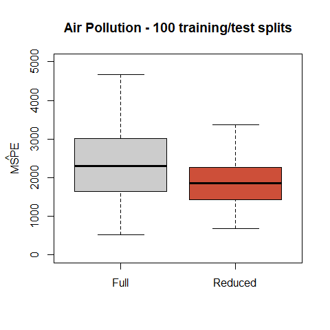

STAT406 - Lecture 2 notes
================
Matias Salibian-Barrera
2017-09-04

Lecture slides
--------------

The lecture slides are [here](STAT406-17-lecture-2.pdf).

Predictions using a linear model
--------------------------------

In these notes we continue looking at the problem of comparing different models based on their prediction properties. As in the previous lecture, we consider a **full** and a **reduced** model, and in all that follows we assume that the variables included in the **reduced** model were not selected using the training data.

### Estimating MSPE with a test set

One way to estimate the mean squared prediction error of a model or predictor is to use it on a test set (where the responses are known, but that was not used when training the predcitor or estimating the model), and the comparing the predictions with the actual responses.

First, we load the training set and fit both models:

``` r
x.tr <- read.table('../Lecture1/pollution-train.dat', header=TRUE, sep=',')
full <- lm(MORT ~ . , data=x.tr)
reduced <- lm(MORT ~ POOR + HC + NOX + HOUS + NONW, data=x.tr)
```

Although the **full** model fits the data better than the reduced one (see Lecture 1), its predictions on the test set are better:

``` r
x.te <- read.table('../Lecture1/pollution-test.dat', header=TRUE, sep=',')
pr.full <- predict(full, newdata=x.te)
pr.reduced <- predict(reduced, newdata=x.te)
with(x.te, mean( (MORT - pr.full)^2 ))
```

    ## [1] 4677.45

``` r
with(x.te, mean( (MORT - pr.reduced)^2 ))
```

    ## [1] 1401.571

In Lecture 1 we also saw that this is not just an artifact of the specific training / test split of the data. The **reduced** model generally produces better predictions, regardless of the specific training / test split we use. We can verify this repeating the procedure many times (50, say) and looking at the estimated mean squared prediction errors obtained each time for each model. 

### Leave-one-out cross-validation

A different procedure to estimate the prediction power of a model or method is called **leave-one-out CV**. One advantage of using this method is that the model we fit can use a larger training set. We discussed the procedure in class. Here we apply it to estimate the mean squared prediction error of the **full** and **reduced** models. Again, we assume that the reduced model was chosen independently from the training set.

``` r
x <- read.csv('../Lecture1/rutgers-lib-30861_CSV-1.csv')
n <- nrow(x)
pr.full <- pr.reduced <- rep(0, n)
for(i in 1:n) {
  full <- lm(MORT ~ . , data=x[-i, ])
  reduced <- lm(MORT ~ POOR + HC + NOX + HOUS + NONW, data=x[-i, ])
  pr.full[i] <- predict(full, newdata = x[i, ])
  pr.reduced[i] <- predict(reduced, newdata = x[i, ])
}
mean( (x$MORT - pr.full)^2 )
```

    ## [1] 2136.785

``` r
mean( (x$MORT - pr.reduced)^2 )
```

    ## [1] 1848.375

### K-fold cross-validation

Leave-one-out cross-validation can be computationally very demanding (or even unfeasible) when the sample size is large and training the predictor is relatively costly. One solution is called **K-fold CV**. We split the data into **K** folds, train the predictor on the data without a fold, and use it to predict the responses in the removed fold. We cycle through the folds, and use the average of the squared prediction errors as an estimate of the mean squared prediction error. The following script does **5-fold CV** for the `full` and `reduced` linear models on the pollution dataset, once again assuming that the reduced model was originally chosen without using the data.

``` r
n <- nrow(x)
k <- 5
pr.full <- pr.reduced <- rep(0, n)
# Create labels for the "folds"
inds <- (1:n) %% k + 1 
# shuffle the rows of x, this is bad coding!
set.seed(123)
xs <- x[ sample(n, repl=FALSE), ]
# loop through the folds
for(j in 1:k) {
  x.tr <- xs[inds != j, ]
  x.te <- xs[inds == j, ]
  full <- lm(MORT ~ . , data=x.tr)
  reduced <- lm(MORT ~ POOR + HC + NOX + HOUS + NONW, data=x.tr)
  pr.full[ inds== j] <- predict(full, newdata=x.te)
  pr.reduced[ inds==j ] <- predict(reduced, newdata=x.te)
}
# compare predictions
mean( (xs$MORT - pr.full)^2 )
```

    ## [1] 2328.806

``` r
mean( (xs$MORT - pr.reduced)^2 )
```

    ## [1] 1854.591

This method is clearly faster than leave-one-out CV, but the results may depend on the specific fold partition, and on the number **K** of folds used.

-   One way to obtain more stable mean squared prediction errors using K-fold CV is to repeat the above procedure many times, and compare the distribution of the mean squared prediction errors for each estimator.

-   A computationally simpler (albeit possibly less precise) way to account for the K-fold variability is to run K-fold CV once and use the sample standard error of the **K** *smaller* mean squared prediction errors to construct a rough *confidence interval* around the overall mean squared prediction error estimate (that is the average of the mean squared prediction errors over the K folds).

-   The dependency of this MSPE on **K** is more involved. We will discuss it later.
