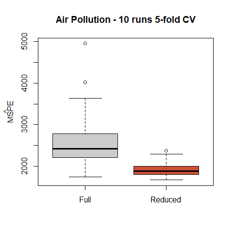
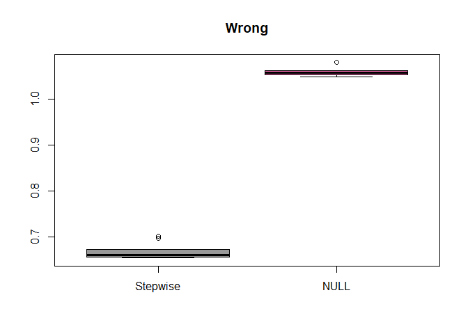

STAT406 - Lecture 3 notes
================
Matias Salibian-Barrera
2017-08-23

Lecture slides
--------------

The lecture slides are [here](STAT406-17-lecture-3.pdf).

Cross-validation
----------------

Load the data

``` r
data <- read.csv('../Lecture1/rutgers-lib-30861_CSV-1.csv')
m.f <- lm(MORT ~ . , data=data)
m.r <- lm(MORT ~ POOR + HC + NOX + HOUS + NONW, data=data)
```

We use 10 runs of 5-fold CV comparing the full and reduced models. Again, here we assume that the reduced model was not obtained using the training data.

``` r
N <- 100
mspe1 <- mspe2 <- vector('double', N)
ii <- (1:(n <- nrow(data))) %% 5 + 1
set.seed(327)
for(i in 1:N) {
  ii <- sample(ii)
  pr.f <- pr.r <- vector('double', n)
  for(j in 1:5) {
    pr.f[ ii == j ] <- predict(update(m.f, data=data[ii != j, ]), newdata=data[ii==j,])
    pr.r[ ii == j ] <- predict(update(m.r, data=data[ii != j, ]), newdata=data[ii==j,])
  }
  mspe1[i] <- with(data, mean( (MORT - pr.f)^2 ))
  mspe2[i] <- with(data, mean( (MORT - pr.r)^2 ))
}  
boxplot(mspe1, mspe2, names=c('Full', 'Reduced'), 
        col=c('gray80', 'tomato3'), 
        main='Air Pollution - 10 runs 5-fold CV')
mtext(expression(hat(MSPE)), side=2, line=2.5)
```



What happens if the model is chosen using the training data?
------------------------------------------------------------

Use forward stepwise (with AIC) on this synthetic data

``` r
library(MASS)
dat <- read.table('fallacy.dat', header=TRUE, sep=',')
n <- nrow(dat)
p <- ncol(dat)
null <- lm(Y~1, data=dat)
full <- lm(Y~., data=dat) # needed for stepwise
step.lm <- stepAIC(null, scope=list(lower=null, upper=full), trace=FALSE)
```

We now attempt to use CV to compare the MSPE of the *null* model (which we know is true) and the one based on stepwise:

``` r
ii <- (1:n) %% 5 + 1
set.seed(17)
N <- 10
mspe.n <- mspe.st <- rep(0, N)
for(i in 1:N) {
  ii <- sample(ii)
  pr.n <- pr.st <- rep(0, n)
  for(j in 1:5) {
    tmp.st <- update(step.lm, data=dat[ii != j, ])
    pr.st[ ii == j ] <- predict(tmp.st, newdata=dat[ii == j, ])
    pr.n[ ii == j ] <- with(dat[ii != j, ], mean(Y)) #mean((dat$Y)[ii != j])
  }
  mspe.st[i] <- with(dat, mean( (Y - pr.st)^2 ))
  mspe.n[i] <- with(dat, mean( (Y - pr.n)^2 ))
}
boxplot(mspe.st, mspe.n, names=c('Stepwise', 'NULL'), col=c('gray60', 'hotpink'), main='Wrong')
```



``` r
summary(mspe.st)
```

    ##    Min. 1st Qu.  Median    Mean 3rd Qu.    Max. 
    ##  0.6533  0.6557  0.6600  0.6675  0.6700  0.7015

``` r
summary(mspe.n)
```

    ##    Min. 1st Qu.  Median    Mean 3rd Qu.    Max. 
    ##   1.047   1.052   1.058   1.058   1.061   1.079

**Something is wrong! **

Correlated covariates
---------------------

Variables that are significant in a smaller model, "dissappear" in a larger one

``` r
# Correlated covariates
x <- read.table('../Lecture1/rutgers-lib-30861_CSV-1.csv', header=TRUE, sep=',')
reduced <- lm(MORT ~ POOR + HC + NOX + HOUS + NONW, data=x)
full <- lm(MORT ~ ., data=x)
# significant variables in "reduced" dissappear in "full"
round( summary(reduced)$coef, 3)
```

    ##             Estimate Std. Error t value Pr(>|t|)
    ## (Intercept) 1172.831    143.241   8.188    0.000
    ## POOR          -4.065      2.238  -1.817    0.075
    ## HC            -1.480      0.333  -4.447    0.000
    ## NOX            2.846      0.652   4.369    0.000
    ## HOUS          -2.911      1.533  -1.899    0.063
    ## NONW           4.470      0.846   5.283    0.000

``` r
round( summary(full)$coef[ names(coef(reduced)), ], 3)
```

    ##             Estimate Std. Error t value Pr(>|t|)
    ## (Intercept) 1763.981    437.327   4.034    0.000
    ## POOR          -0.168      3.227  -0.052    0.959
    ## HC            -0.672      0.491  -1.369    0.178
    ## NOX            1.340      1.006   1.333    0.190
    ## HOUS          -0.651      1.768  -0.368    0.714
    ## NONW           4.460      1.327   3.360    0.002
